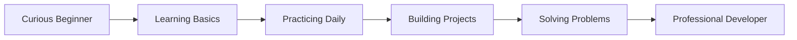

# 👋 Hey, I'm Vivek Gautam 👨‍💻

<p align="center">
  
</p>

<p align="center">
  
  
</p>

---

## 🧠 About Me (Hacker Mindset)

```diff
+ Developer by passion
+ Learner by habit
+ Problem-solver by mindset
```

I'm a **Developer** on a mission to grow from **Beginner ➜ Pro** 🚀
I don't just write code — I **understand it, break it, and rebuild it stronger**.

---

## 🛠️ Tech Arsenal

<p align="center">
  
</p>

```text
Frontend  : HTML | CSS | JavaScript
Backend   : Python | C | C++
Core      : Logic Building | DSA Basics | Problem Solving
```

---

## 🚀 Beginner → Pro Journey



* 🔰 Started with **basics of programming**
* 📚 Learning by **doing + failing + fixing**
* 🧩 Solving problems on **HackerRank**
* 🛠️ Slowly building real-world projects
* 🎯 Goal: Become a **Skilled Full-Stack Developer**

---

## ⚡ What I Do Daily

* 👨‍💻 Write code
* 🧠 Improve logic
* 📈 Learn something new
* 🔁 Repeat consistently

---

## 🌐 Connect With Me

<p align="center">
  <a href="https://www.hackerrank.com/profile/dev_vivekgautam"></a>
  <a href="https://www.linkedin.com/in/vivek-gautam-2737a7367/"></a>
  <a href="https://github.com/devvivekgautam-coder"></a>
  <a href="https://www.instagram.com/mr__india__3207/"></a>
</p>

---

## 🧑‍🚀 Developer Rulebook

```text
while (alive) {
  learn();
  code();
  fail();
  improve();
}
```

> "I'm not aiming to be better than others — I'm aiming to be unstoppable." 🔥

---

---

## 📊 GitHub Stats & Streak

<p align="center">
  
  
</p>

---

## 🛠️ Projects Showcase (Live & Growing)

<p align="center">
  <a href="https://github.com/devvivekgautam-coder" target="_blank">
    
  </a>
  <a href="https://github.com/devvivekgautam-coder" target="_blank">
    
  </a>
</p>

<p align="center">
  <a href="https://github.com/devvivekgautam-coder" target="_blank">
    
  </a>
</p>

> 🔔 *More real-world projects coming soon as I level up…*

---

## 🎨 Dark Neon Developer Theme

```css
background: #0d1117;
accent: neon-green / neon-cyan;
style: clean | minimal | hacker;
mindset: growth-driven;
```

My profile represents a **dark-neon hacker aesthetic** — focused, futuristic, and performance-oriented.

---

## 🧠 AI & Full-Stack Future Vision

```diff
+ Learn Advanced JavaScript & Frameworks
+ Master Backend Development
+ Step into AI & Machine Learning
+ Build intelligent, scalable applications
+ Become a future-ready Full-Stack + AI Developer
```

> "The future belongs to those who build it — one line of code at a time." 🔮

---

## 🎯 Future Goals Roadmap

```diff
+ Master Data Structures & Algorithms
+ Build real-world Full-Stack projects
+ Contribute to Open Source
+ Crack coding interviews
+ Become a Professional Developer
```

---

## 🐍 Contribution Snake

<p align="center">
  
</p>

---

⭐ **Follow my journey from Beginner to Pro** — one commit at a time 🚀
